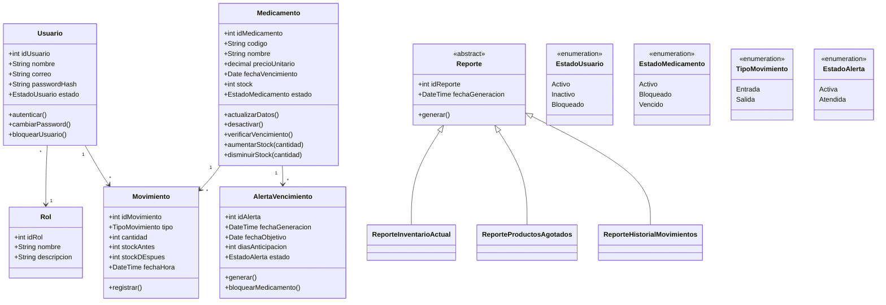
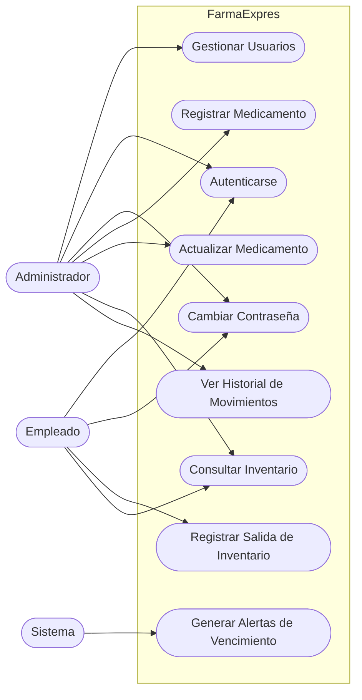

# FarmaExpres-Diagramas

##Diagramas de clases 

```mermaid
classDiagram


class Usuario {
    +int idUsuario
    +String nombre
    +String correo
    +String passwordHash
    +EstadoUsuario estado
    +autenticar()
    +cambiarPassword()
    +bloquearUsuario()
}


class Rol {
    +int idRol
    +String nombre
    +String descripcion
}

class Medicamento {
    +int idMedicamento
    +String codigo
    +String nombre
    +decimal precioUnitario
    +Date fechaVencimiento
    +int stock
    +EstadoMedicamento estado
    +actualizarDatos()
    +desactivar()
    +verificarVencimiento()
    +aumentarStock(cantidad)
    +disminuirStock(cantidad)
}

class Movimiento {
    +int idMovimiento
    +TipoMovimiento tipo
    +int cantidad
    +int stockAntes
    +int stockDEspues
    +DateTime fechaHora
    +registrar()
}

class AlertaVencimiento {
    +int idAlerta
    +DateTime fechaGeneracion
    +Date fechaObjetivo
    +int diasAnticipacion
    +EstadoAlerta estado
    +generar()
    +bloquearMedicamento()
}


class Reporte {
    <<abstract>>
    +int idReporte
    +DateTime fechaGeneracion
    +generar()
}


class ReporteInventarioActual
class ReporteProductosAgotados
class ReporteHistorialMovimientos

%% ENUMERACIONES

class EstadoUsuario {
    <<enumeration>>
    Activo
    Inactivo
    Bloqueado
}


class EstadoMedicamento {
    <<enumeration>>
    Activo
    Bloqueado
    Vencido
}

class TipoMovimiento {
    <<enumeration>>
    Entrada
    Salida
}

class EstadoAlerta {
    <<enumeration>>
    Activa
    Atendida
}

%% RELACIONES

Usuario "*" --> "1" Rol
Usuario "1" --> "*" Movimiento
Medicamento "1" --> "*" Movimiento
Medicamento "1" --> "*" AlertaVencimiento

Reporte <|-- ReporteInventarioActual
Reporte <|-- ReporteProductosAgotados
Reporte <|-- ReporteHistorialMovimientos

```
## Diagrama de casos de usos

```mermaid

flowchart LR

Administrador([Administrador])
Empleado([Empleado])
Sistema([Sistema])

subgraph FarmaExpres

UC1([Gestionar Usuarios])
UC2([Autenticarse])
UC3([Cambiar Contraseña])

UC4([Registrar Medicamento])
UC5([Actualizar Medicamento])

UC6([Registrar Salida de Inventario])
UC7([Consultar Inventario])

UC8([Generar Alertas de Vencimiento])

UC11([Ver Historial de Movimientos])

end

%% Relaciones Administrador
Administrador --> UC1
Administrador --> UC2
Administrador --> UC3
Administrador --> UC4
Administrador --> UC5
Administrador --> UC7
Administrador --> UC11

%% Relaciones Farmacéutico
Empleado --> UC2
Empleado --> UC3
Empleado --> UC6
Empleado --> UC7


%% Sistema genera alertas automáticamente
Sistema --> UC8
```
