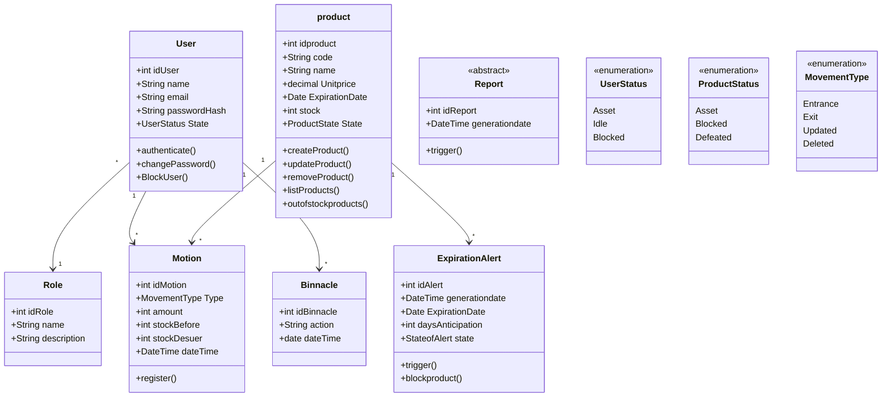
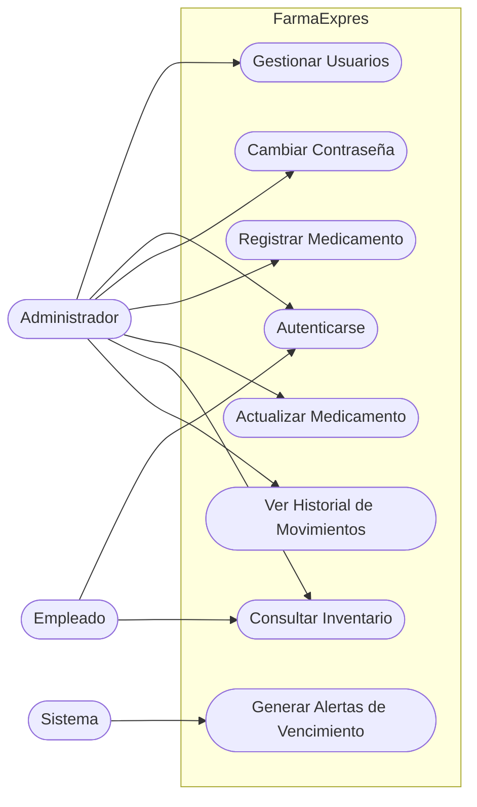
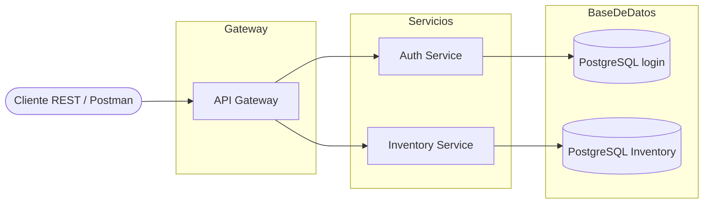
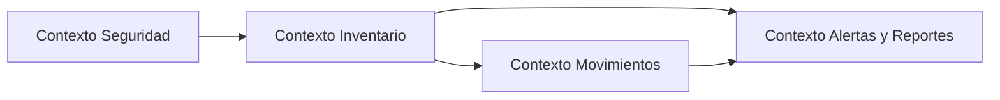

# FarmaExpres-Diagramas

## [Diagrama de BPMN](./FarmaExpres_BPMN_MVP_v1_0.pdf)

## Diagramas de clases 

## Diagrama de casos de usos

## Diagrama de Arquitectura Base

### Diagrama de Contexto

