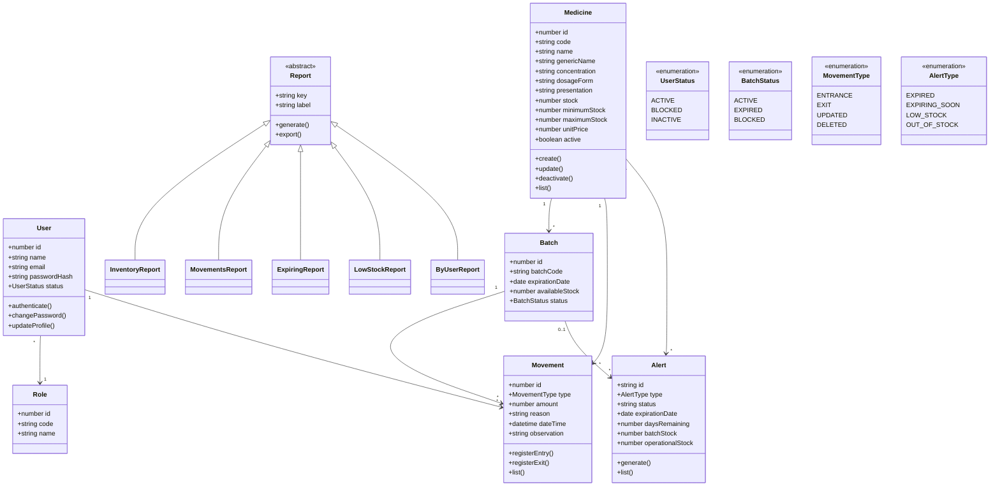
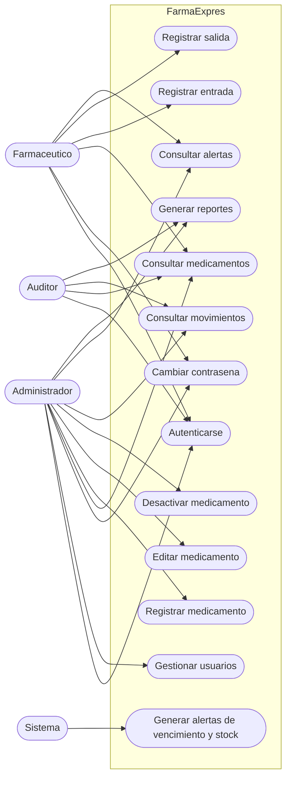
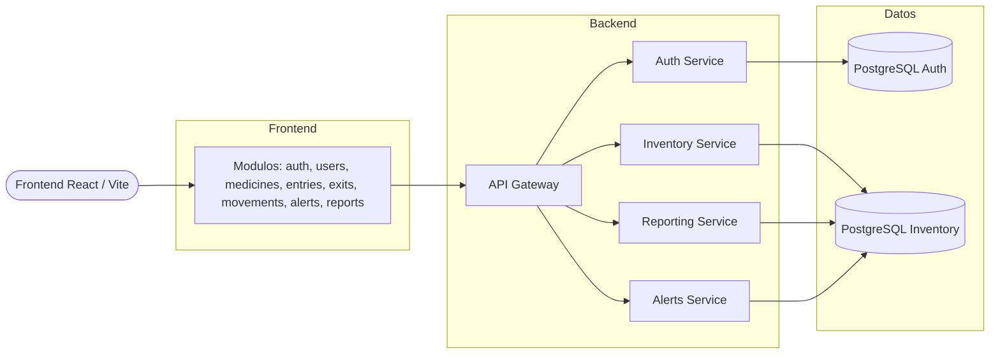
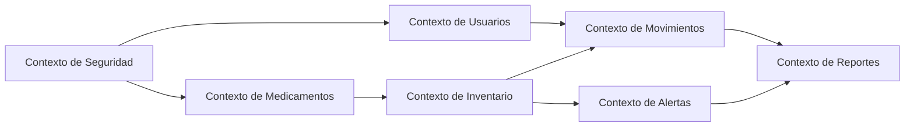

# FarmaExpres-Diagramas

## Diagrama BPMN

- [Proceso BPMN del MVP](./FarmaExpres_BPMN_MVP_v1_0.pdf)

## Diagrama de clases

## Diagrama de casos de uso

## Diagrama de arquitectura base

## Diagrama de contexto

## Alineacion con el frontend actual

Este repositorio de diagramas queda alineado con los modulos funcionales actualmente implementados en el frontend:

- `auth`
- `users`
- `medicines`
- `entries`
- `exits`
- `movements`
- `alerts`
- `reports`

Notas:

- `dashboard` y `audit` aparecen en la referencia visual, pero no forman parte de las rutas funcionales actuales del frontend.
- Los reportes actualmente contemplados en la interfaz son: inventario actual, movimientos, proximos a vencer, bajo stock y por usuario.
- Las alertas actuales contemplan: vencidos, proximos a vencer, bajo stock y agotados.
