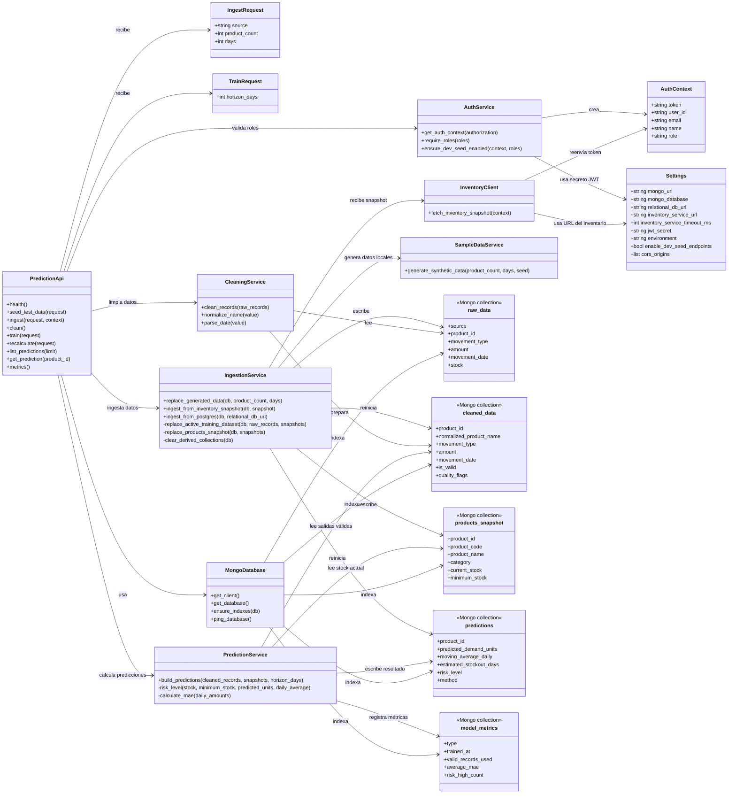

# Diagrama de clases del microservicio de predicción NoSQL

Este documento explica cómo está organizado el microservicio de predicción de FarmaExpres. El módulo no reemplaza el backend principal: toma datos del inventario relacional, los guarda en MongoDB, limpia los registros y calcula una predicción sencilla de demanda para apoyar la reposición de medicamentos.

## Alcance del diagrama

El diagrama representa las clases y módulos principales del servicio Python con FastAPI:

- `IngestRequest` define desde dónde se cargan los datos: inventario, PostgreSQL o datos generados para pruebas.
- `TrainRequest` define cuántos días se quieren proyectar.
- `PredictionApi` agrupa los endpoints públicos y los endpoints integrados bajo `/api/predictions`.
- `Settings` centraliza variables de ambiente como MongoDB, URL del inventario y seguridad JWT.
- `MongoDatabase` representa el acceso a MongoDB y sus colecciones.
- `AuthContext` representa la información del usuario autenticado que llega desde el token JWT.
- `InventoryClient` consulta el snapshot del `inventory-service`.
- `IngestionService` transforma la información relacional o del inventario en documentos crudos y snapshots de productos.
- `CleaningService` normaliza los registros, elimina duplicados y marca problemas de calidad.
- `PredictionService` calcula la demanda esperada usando promedio móvil de 30 días.
- Las colecciones de MongoDB separan datos crudos, datos limpios, predicciones, métricas y copia de productos.

## Diagrama

## Explicación del funcionamiento

El flujo inicia cuando el frontend o el API Gateway llama al endpoint de ingesta. Si la fuente es `inventory`, el microservicio usa el token JWT del usuario y consulta el endpoint de snapshot del `inventory-service`. Ese snapshot contiene productos, lotes y movimientos del inventario relacional. El microservicio no modifica esos datos en PostgreSQL; solo los lee y crea una copia analítica en MongoDB.

La colección `raw_data` almacena los movimientos tal como llegan o como fueron generados para pruebas. La colección `products_snapshot` guarda el estado resumido de cada medicamento, especialmente nombre, código, categoría, stock actual y stock mínimo. Con esa separación, el modelo puede calcular demanda histórica sin depender todo el tiempo de consultas directas al sistema relacional.

Después se ejecuta la limpieza. `CleaningService` convierte fechas a formato estándar, normaliza nombres de medicamentos, elimina duplicados, valida cantidades negativas o faltantes y marca registros incompletos con `quality_flags`. Los registros resultantes se guardan en `cleaned_data`. Los registros inválidos no desaparecen del análisis: quedan identificados para que las métricas indiquen cuántos datos no deberían usarse para calcular demanda.

El entrenamiento lo realiza `PredictionService`. El algoritmo usado es un promedio móvil de 30 días sobre movimientos de tipo `Exit`, porque las salidas de inventario representan demanda histórica. Para cada medicamento se calcula el promedio diario reciente, se multiplica por el horizonte configurado, normalmente 7 días, y se estima si el stock actual alcanza para cubrir esa demanda. Con esa información se clasifica el riesgo como `OUT_OF_STOCK`, `HIGH`, `MEDIUM` o `LOW`.

Finalmente, las predicciones se guardan en `predictions` y las métricas del proceso se guardan en `model_metrics`. El frontend consulta esas colecciones por medio de la API para mostrar demanda esperada, riesgo de agotamiento, prioridad de reposición, cantidad de datos limpios y error medio aproximado.

## Relación con el backend principal

El backend principal conserva la lógica operativa de FarmaExpres: usuarios, autenticación, medicamentos, inventario, movimientos y alertas. El microservicio predictivo queda como una capa analítica independiente. La integración profesional se hace por medio del API Gateway y del `inventory-service`, no escribiendo directamente en las tablas relacionales.

Cuando se ejecuta en Docker, cada ambiente (`dev`, `qa` o `main`) tiene sus propias variables de entorno, base MongoDB y puertos. Esto permite probar el modelo sin mezclar datos entre ambientes.

## Decisiones representadas

- MongoDB se usa para guardar datos flexibles de análisis, no para reemplazar PostgreSQL.
- PostgreSQL sigue siendo la fuente operativa de verdad del inventario.
- La limpieza de datos ocurre antes de entrenar o recalcular predicciones.
- La predicción usa un método simple, verificable y fácil de sustentar: promedio móvil de 30 días.
- El modelo prioriza medicamentos por demanda esperada y riesgo de agotamiento, que son variables útiles para reposición.
- Los datos generados son solo para pruebas y validación local, no para producción.
